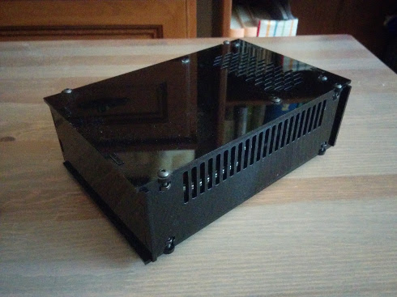
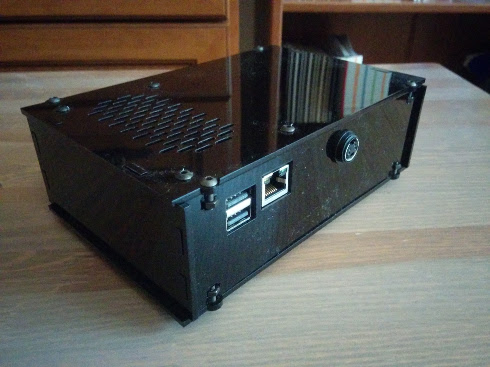

A laser-cut enclosure for Banana Pro.

Features
--------
- designed to be laser cut from 3mm acrylic
- holds a 3.5" HDD
- holes for Ethernet and USB connector and a DIN PSU connector

BOM
---
- M3x10 screws + nuts for T-slots (8pcs)
- M3x16 screws + nuts (4pcs) and 5mm spacers for Banana Pro 
- #6-32 UNC screw (4pcs) for HDD

In addition, SATA cable and power connector will be needed as well as
a PSU. I've used dual 5V + 12V PSU typically used for powering external
HDD enclosures.

Images
------

License
-------
CC BY-NC-SA 4.0
